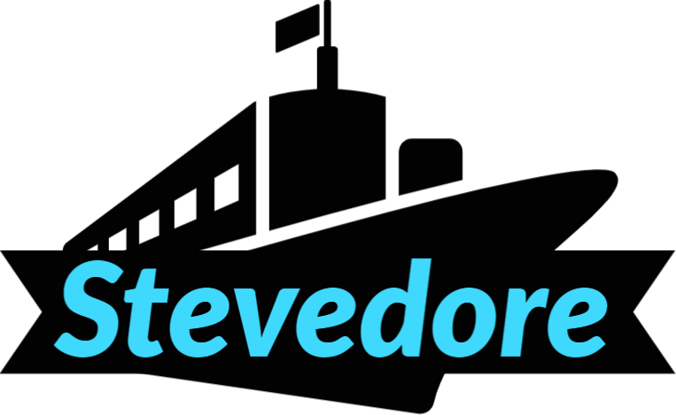

<div align="center">




# StevedoreApp - A

</div>


## **Team**
+ Luke
+ Michal
+ Rahul
+ Julian


## **Commits**
Usage:

- Use crucial and appropriate [Gitmojis](https://gitmoji.carloscuesta.me/)!
- No complete sentences
- If project has issues link them to the merge request
- Fix, Update, Implement are Keys which should be used on every commit


## **Docker**

Build docker image from project
```
 mvn clean install -P dockerize
```

Run docker image directly using 

```
docker run -p 8080:8080 stevedoredevops/stevedore:1.0.0-SNAPSHOT
```

See container information
```
docker ps
```

See logs in running container
```
docker logs <container id>

docker logs --follow  <container id>
```

Stop the container

```
docker stop  <container id>
```

Stop and remove the container image
```
docker rm -f <container id>
```